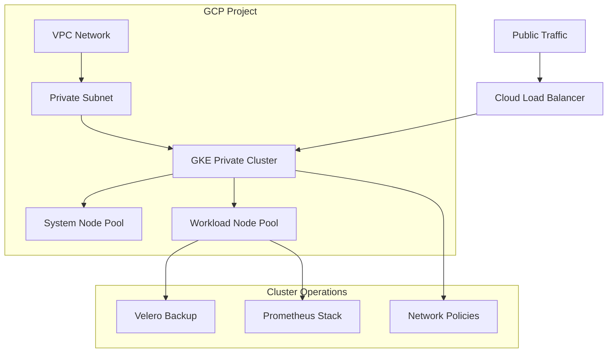

⚠️ **Early Stage Project**  
This repository is under active development. The Terraform module is functional. Helm charts, migration scripts, and full observability stack are in progress.

# Enterprise Kubernetes GKE Migration Platform

**Production-grade Kubernetes deployment and migration framework for Google Kubernetes Engine (GKE)** with enterprise security, observability, Infrastructure as Code, and automated DevOps workflows.

---

## Overview

This platform provides a complete enterprise Kubernetes migration and deployment ecosystem for Google Cloud Platform (GCP), enabling organizations to deploy, migrate, scale, and secure workloads on GKE with production-grade reliability.

### Core Capabilities

- ✅ GKE cluster provisioning & lifecycle management
- ✅ Zero-downtime application deployments
- ✅ Multi-cluster migration workflows
- ✅ RBAC & Network Policy security hardening
- ✅ Infrastructure as Code using Terraform
- ✅ Helm-based application packaging
- ✅ Observability (Prometheus + Grafana)
- ✅ High availability & autoscaling
- ✅ GitOps & CI/CD automation

---

## Architecture

mermaid
graph TD
    subgraph "GCP Project"
        VPC[VPC Network] --> Subnet[Private Subnet]
        Subnet --> GKE[GKE Private Cluster]
        GKE --> SP[System Node Pool]
        GKE --> WP[Workload Node Pool]
    end
    
subgraph "Cluster Operations"
        WP --> Velero[Velero Backup]
        WP --> Prom[Prometheus + Grafana]
        GKE --> NetPol[Network Policies + RBAC]
    end

    
Internet[Public Traffic] --> LB[Cloud Load Balancer]
    LB --> GKE

 Enterprise FeaturesKubernetes OrchestrationMulti-zone GKE clusters
Horizontal & vertical autoscaling
Rolling updates & canary deployments
StatefulSets, DaemonSets, Pod Disruption Budgets

Security & CompliancePrivate GKE clusters
RBAC with least-privilege access
Zero-trust Network Policies
IAM integration, Binary Authorization, Secret encryption

Monitoring & ObservabilityPrometheus + Grafana
Centralized logging (ELK)
Distributed tracing (Jaeger)

High Availability & RecoveryMulti-zone redundancy
Automated backup & disaster recovery (Velero)
Self-healing workloads

Repository Structure

kubernetes-gke-migration/
├── terraform/          # Infrastructure provisioning (GKE + VPC)
├── helm/               # Helm charts for platform components
├── k8s/                # Kubernetes manifests
├── monitoring/         # Prometheus & Grafana configs
├── scripts/            # Automation & migration scripts
├── security/           # Security policies and hardening
├── docs/               # Documentation
├── examples/           # Sample workloads
├── tests/              # Validation tests
└── .github/workflows/  # CI/CD pipelines4. Deploy Platform Components

Quick Start 
1. Install Dependencies

# Install Google Cloud SDK, kubectl, Terraform & Helm
curl https://sdk.cloud.google.com | bash
gcloud components install kubectl
brew install terraform helm

2. Provision Infrastructure

cd terraform
terraform init
terraform plan -var-file=terraform.tfvars
terraform apply -auto-approve

3. Configure Cluster Access

gcloud container clusters get-credentials gke-cluster \
  --region us-central1 \
  --project YOUR_PROJECT_ID

  4. Deploy Platform Components

cd ../helm
helm install gke-platform ./gke-platform \
  --namespace production \
  --create-namespace \
  --values values-prod.yaml

  5. Validate

kubectl get nodes -o wide
kubectl get pods --all-namespaces

Operations

Migration: bash scripts/migrate.sh <source> <target>
Backup: bash scripts/backup.sh production
Health Check: bash scripts/health-check.sh
Scale Cluster: bash scripts/scale-cluster.sh 5

Production Readiness Enterprise-grade architecture
 High availability & autoscaling
 Security hardening
 Monitoring & logging
 Disaster recovery
 CI/CD automation  

Contributing

git checkout -b feature/your-feature
# Make changes
bash tests/validate-manifests.sh
git commit -m "feat: add your feature"
git push origin feature/your-feature

Author
Paul Nyoike — Backend & DevOps Engineer
GitHub: @NyoikePaulLicense
MIT License — see the LICENSE file for details.

 Enterprise Kubernetes on GCP • Production Ready • Actively Developed

