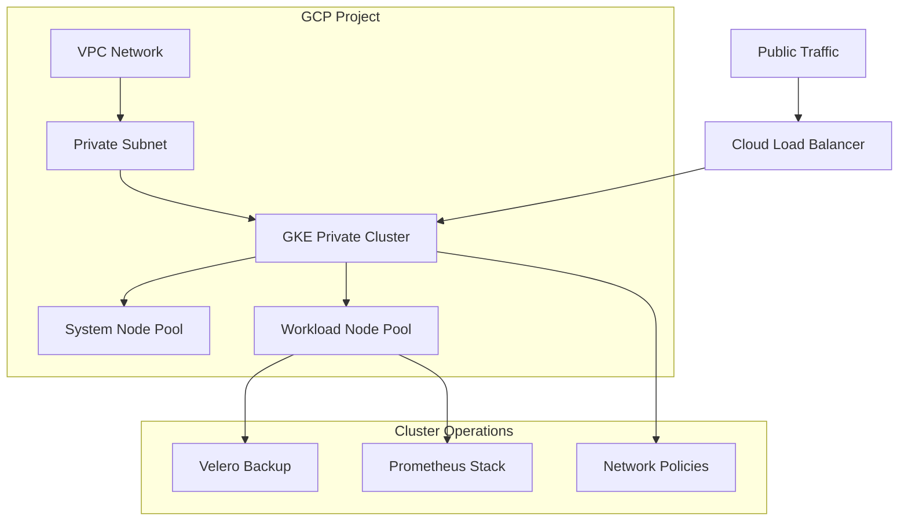

⚠️ **Early Stage Project**  
This repository is under active development. Terraform module is functional. Helm charts, migration scripts, and full observability stack are in progress.

#  Enterprise Kubernetes GKE Migration Platform
# Kubernetes GKE Migration Platform

> Enterprise-grade GKE migration platform...

Production-grade Kubernetes deployment and migration framework for Google Kubernetes Engine (GKE) with enterprise security, observability, Infrastructure as Code, and automated DevOps workflows.

---

##  Overview

This platform provides a complete enterprise Kubernetes migration and deployment ecosystem for Google Cloud Platform (GCP), enabling organizations to deploy, migrate, scale, and secure workloads on GKE with production-grade reliability.

### Core Capabilities

- ✅ GKE cluster provisioning & lifecycle management
- ✅ Multi-cluster migration workflows
- ✅ Zero-downtime application deployments
- ✅ RBAC & network security hardening
- ✅ Prometheus/Grafana observability stack
- ✅ Disaster recovery & backup automation
- ✅ Infrastructure as Code using Terraform
- ✅ Helm-based Kubernetes packaging
- ✅ GitOps & CI/CD automation
- ✅ High availability & autoscaling

---

#  Architecture

graph TD
    A[Google Cloud Platform] --> B[GKE Cluster]
    B --> C[Ingress Controller]
    C --> D[Load Balancer Services]
    D --> E[Deployments]
    D --> F[StatefulSets]
    E --> G[Application Pods]
    E --> H[Worker Pods]
    F --> I[Database Pods]
    F --> J[Redis Cache]
    B --> K[Persistent Volumes]
    K --> L[GCE Persistent Disks]
    B --> M[Prometheus & Grafana]
    B --> N[ELK Logging Stack]
    B --> O[RBAC & Network Policies]
    A --> P[Cloud SQL]
    A --> Q[Cloud Storage]
    A --> R[Cloud Memorystore]
    
 Enterprise Features
☸️ Kubernetes Orchestration
Multi-zone GKE clusters
Horizontal & vertical autoscaling
Rolling updates & canary deployments
StatefulSets for persistent workloads
DaemonSets for node-level services
Pod Disruption Budgets
CronJobs & batch processing

 Security & Compliance
RBAC with least-privilege access
Network Policies for zero-trust networking
Private GKE clusters
IAM integration
TLS/SSL encryption
Binary Authorization
Audit logging
Secret management & encryption

 Networking
NGINX Ingress Controller
Internal & external load balancing
DNS automation
Service mesh ready (Istio compatible)
TLS termination
Traffic segmentation

 Monitoring & Observability
Prometheus metrics collection
Grafana dashboards
ELK centralized logging
Distributed tracing with Jaeger
AlertManager notifications
SLA/SLO monitoring

 High Availability
Multi-zone redundancy
Automatic failover
Pod anti-affinity rules
Backup & disaster recovery
Resource quotas & limits
Self-healing workloads

 Repository Structure
kubernetes-gke-migration/
├── terraform/          # Infrastructure provisioning
├── helm/               # Helm charts
├── k8s/                # Kubernetes manifests
├── monitoring/         # Prometheus/Grafana configs
├── logging/            # ELK stack configs
├── security/           # Security hardening
├── scripts/            # Automation scripts
├── docs/               # Technical documentation
├── examples/           # Example workloads
├── tests/              # Validation & integration tests
└── ci-cd/              # GitHub Actions & CI pipelines
 Quick Start
 
1️⃣ Install Dependencies
curl https://sdk.cloud.google.com | bash
gcloud components install kubectl
brew install terraform helm

2️⃣ Provision Infrastructure
cd terraform

terraform init
terraform plan -var-file=terraform.tfvars
terraform apply

3️⃣ Configure Cluster Access
gcloud container clusters get-credentials gke-cluster \
  --region us-central1 \
  --project PROJECT_ID
  
4️⃣ Deploy Platform
cd ../helm

helm install gke-platform ./gke-platform \
  --namespace production \
  --values values-prod.yaml
  
5️⃣ Validate Deployment
kubectl get all --all-namespaces
kubectl get nodes -o wide
kubectl get pods -o wide

🔄 Operations
Multi-Cluster Migration
bash scripts/migrate.sh source-cluster target-cluster
Automated Backup
bash scripts/backup.sh production
Health Validation
bash scripts/health-check.sh
Cluster Scaling
bash scripts/scale-cluster.sh 5

 Production Security
Zero-trust network architecture
Secrets encryption at rest
Namespace isolation
Resource quotas & limits
Pod security enforcement
Continuous image scanning
TLS everywhere

 CI/CD & GitOps
GitHub Actions workflows
GitLab CI/CD integration
Canary deployments
Blue-Green deployments
Automated rollback
Infrastructure validation pipelines

 Documentation
Guide	Description
ARCHITECTURE.md	System design
SETUP.md	Cluster setup
DEPLOYMENT.md	Deployment workflows
MIGRATION.md	Migration procedures
SECURITY.md	Security hardening
MONITORING.md	Observability stack
BACKUP-RESTORE.md	Disaster recovery
BEST-PRACTICES.md	Production recommendations

 Production Readiness
✅ Enterprise-grade architecture
✅ High availability
✅ Autoscaling support
✅ Disaster recovery
✅ Security hardening
✅ Monitoring & logging
✅ CI/CD automation
✅ Migration-tested workflows

 Contributing
git checkout -b feature/my-feature
bash tests/validate-manifests.sh
git commit -m "feat: add new feature"
git push origin feature/my-feature

 Author
Paul Nyoike
GitHub: https://github.com/NyoikePaul
Portfolio: https://nyoikepaul.github.io

 License
MIT License — see the LICENSE file for details.

⭐ Enterprise Kubernetes. Cloud Native. Production Ready.
## Architecture

## Features
- **VPC-Native GKE:** Optimized networking with Alias IP ranges.
- **Private Clusters:** Nodes have no public IPs for maximum security.
- **Disaster Recovery:** Velero-integrated backup and migration.
- **Zero-Trust:** Default-deny Network Policies.
- **CI/CD:** Automated Terraform validation via GitHub Actions.
