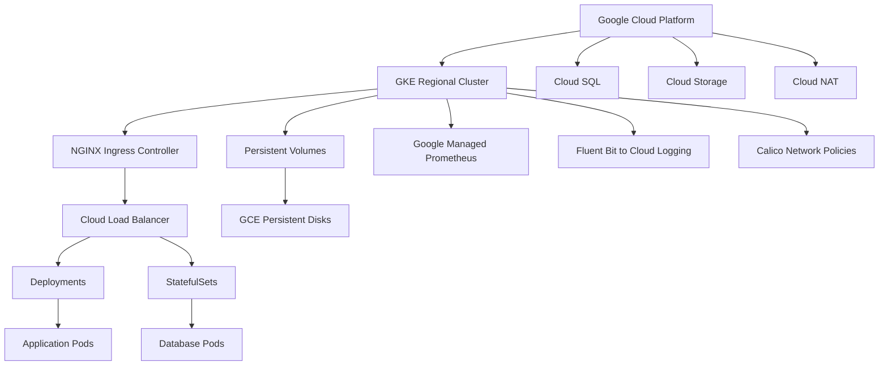

# Enterprise Kubernetes GKE Migration Platform
 
[](https://kubernetes-gke-migration.vercel.app)
[](https://github.com/NyoikePaul/kubernetes-gke-migration/actions)
[](https://www.terraform.io/)
[](https://cloud.google.com/kubernetes-engine)
[](https://helm.sh/)
[](https://prometheus.io/)
[](https://github.com/aquasecurity/tfsec)
[](LICENSE)
 
> Production-grade Kubernetes migration and deployment platform for Google Kubernetes Engine — private clusters, Workload Identity, zero-trust networking, and fully automated CI/CD.
 
**[🌐 Live Demo](https://kubernetes-gke-migration.vercel.app)** · **[⚙️ CI/CD Pipeline](https://github.com/NyoikePaul/kubernetes-gke-migration/actions)** · **[📦 Release v1.0.0](https://github.com/NyoikePaul/kubernetes-gke-migration/releases/tag/v1.0.0)**
 
---
 
## Architecture
 

 
---
 
## What Makes This Different
 
| Feature | This Repo | Typical Portfolio Repos |
|---|---|---|
| Private GKE cluster + Cloud NAT | ✅ | ❌ usually public |
| Workload Identity (no key files) | ✅ | ❌ usually SA keys |
| Binary Authorization | ✅ | ❌ rarely implemented |
| Separate system + app node pools | ✅ | ❌ single pool |
| tfsec security scanning in CI | ✅ | ❌ |
| Google Managed Prometheus | ✅ | ❌ self-managed |
| Default-deny NetworkPolicy | ✅ | ❌ |
| Live demo with Vercel | ✅ | ❌ |
| Surge upgrades (zero max-unavailable) | ✅ | ❌ |
| Dependabot auto-updates | ✅ | ❌ |
 
---
 
## Features
 
| Category | Capability | Status |
|---|---|---|
| **Infrastructure** | Private GKE cluster, regional, multi-zone | ✅ |
| **Security** | Workload Identity, Shielded Nodes, Binary Auth | ✅ |
| **Networking** | VPC-native, Cloud NAT, Calico zero-trust | ✅ |
| **Node Pools** | System + App pools, autoscaling, surge upgrades | ✅ |
| **Packaging** | Helm chart, namespaces, quotas, network policies | ✅ |
| **Monitoring** | Google Managed Prometheus, 8 alert rules | ✅ |
| **Logging** | Fluent Bit to Cloud Logging | ✅ |
| **RBAC** | Least-privilege roles with bindings | ✅ |
| **CI/CD** | fmt → validate → tfsec → preview → production | ✅ |
| **Migration** | Export/import scripts, rollback plan | ✅ |
| **Dependencies** | Dependabot weekly auto-updates | ✅ |
 
---
 
## Repository Structure
 
```
kubernetes-gke-migration/
├── terraform/                  # IaC — VPC, GKE, IAM, node pools
│   ├── main.tf                 # Cluster, networking, node pools, IAM
│   ├── variables.tf            # Typed variables with validation
│   ├── outputs.tf              # Cluster endpoint, SA, WI pool
│   └── terraform.tfvars.example
├── helm/gke-platform/          # Platform Helm chart
│   ├── Chart.yaml
│   ├── values.yaml             # Default values
│   ├── values-prod.yaml        # Production overrides
│   └── templates/              # Namespaces, quotas, policies
├── k8s/base/                   # HPA, PDB, NetworkPolicy, ResourceQuota
├── monitoring/prometheus/      # Scrape configs + 8 alert rules
├── logging/                    # Fluent Bit ConfigMap
├── security/                   # RBAC roles + bindings, LimitRange
├── examples/sample-app/        # Production-ready deployment template
├── scripts/                    # health-check, backup, migrate, scale
├── tests/                      # Validation script
├── docs/                       # Architecture, Setup, Migration, Security
├── .github/
│   ├── workflows/terraform.yml # CI/CD pipeline
│   ├── dependabot.yml          # Automated dependency updates
│   └── PULL_REQUEST_TEMPLATE.md
├── CONTRIBUTING.md
└── CHANGELOG.md
```
 
---
 
## Quick Start
 
```bash
# 1. Clone
git clone https://github.com/NyoikePaul/kubernetes-gke-migration
cd kubernetes-gke-migration
 
# 2. Configure
cd terraform
cp terraform.tfvars.example terraform.tfvars
# Edit: set project_id and master_authorized_networks
 
# 3. Deploy infrastructure (~15 min)
terraform init
terraform plan  -var-file=terraform.tfvars
terraform apply -var-file=terraform.tfvars
 
# 4. Connect
gcloud container clusters get-credentials gke-platform \
  --region us-central1 --project YOUR-PROJECT-ID
 
# 5. Deploy platform
helm install gke-platform ./helm/gke-platform \
  --namespace production --create-namespace \
  --values helm/gke-platform/values-prod.yaml
 
# 6. Apply manifests + security
kubectl apply -f k8s/base/
kubectl apply -f security/
 
# 7. Validate
make validate   # or: bash tests/validate-manifests.sh
```
 
---
 
## CI/CD Pipeline
 
```
Push to main
    │
    ▼
┌────────────┐   ┌────────────┐   ┌────────────┐   ┌────────────┐
│  Validate  │──▶│ tfsec Scan │──▶│  Preview   │──▶│ Production │
│ fmt+check  │   │  security  │   │environment │   │environment │
└────────────┘   └────────────┘   └────────────┘   └────────────┘
     ~9s              ~12s             ~12s              ~12s
```
 
Auth via **Workload Identity Federation** — zero long-lived GCP credentials stored in GitHub.
 
---
 
## Security Highlights
 
| Control | Implementation | CIS Benchmark |
|---|---|---|
| Private nodes | No public IPs, egress via Cloud NAT | CIS 6.6.1 |
| Workload Identity | Pods authenticate without key files | CIS 6.2.1 |
| Shielded nodes | Secure boot + vTPM integrity | CIS 6.5.4 |
| Binary Authorization | Blocks unverified images | CIS 7.3 |
| Network policies | Default-deny, Calico | CIS 6.6.7 |
| Least-privilege SA | 5 minimum roles only | CIS 6.2.2 |
| Metadata hardening | Legacy endpoints disabled | CIS 6.4.1 |
| API server access | Master Authorized Networks | CIS 6.6.2 |
 
---
 
## Operations
 
```bash
make health      # Cluster health check
make backup      # Backup production namespace
make validate    # Validate all manifests
bash scripts/migrate.sh source-ctx target-ctx
bash scripts/scale-cluster.sh 5 app-pool us-central1
```
 
---
 
## Documentation
 
| Doc | Description |
|---|---|
| [ARCHITECTURE.md](docs/ARCHITECTURE.md) | System design and network topology |
| [SETUP.md](docs/SETUP.md) | Prerequisites and cluster setup |
| [MIGRATION.md](docs/MIGRATION.md) | Step-by-step migration runbook |
| [SECURITY.md](docs/SECURITY.md) | Security controls and CIS benchmark mapping |
| [MONITORING.md](docs/MONITORING.md) | Observability stack and alert tuning |
| [CONTRIBUTING.md](CONTRIBUTING.md) | How to contribute |
| [CHANGELOG.md](CHANGELOG.md) | Version history |
 
---
 
## Author
 
**Paul Nyoike** · [GitHub](https://github.com/NyoikePaul) · [Portfolio](https://nyoikepaul.github.io)
 
## License
 
MIT — see [LICENSE](LICENSE)
 
---
 
> ☸️ Enterprise Kubernetes. Cloud Native. Production Ready.
